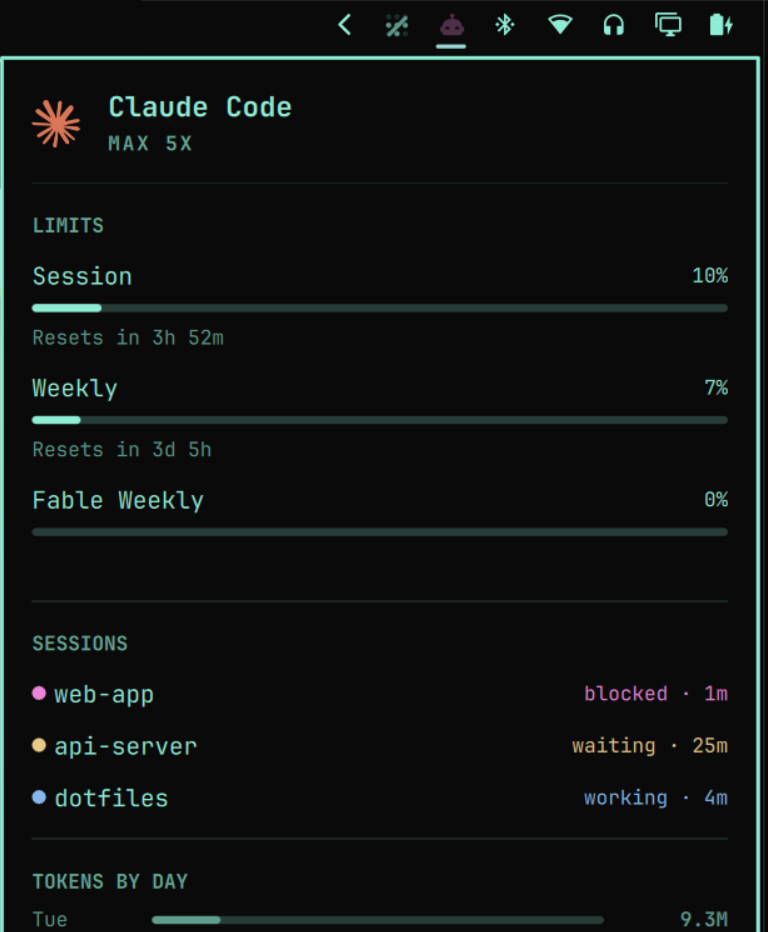

# Agents + Claude Status

An Omarchy bar widget that shows what Claude Code is doing, on the same button
as your AI usage limits.

The icon takes a colour and a rhythm from whatever Claude is up to across every
open session, the tooltip names the session that wants you, and the panel grows
a SESSIONS list under LIMITS.



| State | Colour | Motion | When |
|---|---|---|---|
| idle | theme foreground | still | nothing running |
| working | blue | slow 1.5s breath | prompt submitted, tools running |
| waiting | amber | fast 0.6s pulse | turn finished, your move |
| blocked | magenta | fast 0.6s pulse | a question, plan approval, or permission request |

Loudest state wins, so one session stuck on a question outranks another quietly
working, and the tooltip reads `Claude · needs an answer — web-app +2 more`.

## Read this before installing

**This is a fork of Omarchy's built-in `omarchy.agents` widget, not an addition
to it.** It bundles that widget's code so status and usage can share one bar
button instead of taking two. Installing it means:

- You will have **two AI icons** until you take the built-in one off your bar:
  `omarchy plugin disable omarchy.agents`.
- The bundled copy of `agents` is **frozen at the Omarchy it was forked from**.
  Upstream fixes to the usage panel reach you when you run `./resync`, not when
  you run `omarchy update`. See [Staying current](#staying-current).

If you only want the status colours and would rather leave your agents widget
alone, this is the wrong plugin — you want a standalone status widget instead.

## Install

```sh
omarchy plugin add https://github.com/AvAl4nch/omarchy-agents-claude-status.git --enable
cd ~/.config/omarchy/plugins/io.github.aval4nch.agents-claude-status
./setup
omarchy restart shell
```

`setup` is not optional. The widget only ever *reads* files; what writes them is
a small script driven by Claude Code's hooks, and Omarchy plugins have no
install step of their own. Skip it and the widget installs looking perfectly
normal and silently never changes colour.

`./setup` installs `~/.local/bin/omarchy-claude-status` and registers six hooks
in `~/.claude/settings.json`. It backs the file up first, appends rather than
replacing (so hooks you already had survive), and re-running replaces its own
entries instead of stacking duplicates. Check it with `./setup --status`.

Claude Code re-reads `settings.json` without restarting, so sessions you already
have open pick the hooks up on their next tool call.

## How it works

| Hook | Reports |
|---|---|
| `UserPromptSubmit`, `PreToolUse`, `PostToolUse` | working |
| `Notification` | blocked |
| `Stop` | waiting |
| `SessionEnd` | forget this session |

The script refines those from the payload. `PreToolUse` for `AskUserQuestion` or
`ExitPlanMode` becomes **blocked**, because those fire and then block on an
answer — reported as "working" they would paint the icon busy for exactly as
long as it is actually your turn. `Notification` splits on its message: the
"waiting for your input" nudge only ever arrives after a turn already ended, so
it stays **waiting** rather than being promoted to a false stall.

State lands in `~/.local/state/omarchy/claude-status/`:

```
state          # two lines: winning state, then "<label> +N more"
sessions.tsv   # one line per session: rank, state, label, mtime
sessions/      # one file per session id: "<state>TAB<label>"
```

A session killed without firing `SessionEnd` would pin the icon lit forever, so
anything untouched for eight hours is treated as gone.

### Colours

Status colours are **not** read from theme roles, because theme roles are not
reliably distinct — Omarchy's BlackTurq resolves both `accent` and `urgent` to
nearly the same cyan, which would make "working" and "idle" the same icon.
Instead the theme's own saturation and lightness are kept, tuned as they are for
contrast against your bar in light themes and dark, and only the hue is set.
Blue and amber stay apart under the common kinds of colour blindness, and motion
carries the state as well as colour in case a theme sits on one of those hues.

## Staying current

Forks drift. Upstream keeps improving `agents/`, and is free to rename the
`qs.Ui` components this leans on. After `omarchy update`:

```sh
./resync            # re-take upstream's files, re-apply our patches
./resync --diff     # what upstream changed since the last resync
./resync --check    # verify the patches are in place, touch nothing
omarchy restart shell
```

Everything original lives in `ClaudeStatus.qml` and `ClaudeSessions.qml`, which
upstream never touches. The delta to their files is four patches to `Panel.qml`
and the bounds on the sync path in `Main.qml` (see [Security](#security)), all
marked `[claude-status]`. `resync` validates the manifest and runs `qmllint` over
both original files, and fails loudly if an anchor stops matching rather than
leaving a half-patched file — that failure is the signal upstream restructured
the file and a human is needed.

Two Omarchy quirks worth knowing if you hack on this:

- **A shell restart is required after any QML edit.** Hot-reload logs
  `Local plugin changed, reloading` but keeps running the previously compiled
  unit. Stale error line numbers in the journal are the tell.
- **Watch out for a missed migration.** Omarchy renames widget ids in migrations
  by matching literal strings — `1786099804.sh` renamed `omarchy.model-usage` to
  `omarchy.agents` that way. A future migration doing the same would walk past
  this plugin's id and the widget would quietly leave your bar.

## Removing

```sh
cd ~/.config/omarchy/plugins/io.github.aval4nch.agents-claude-status
./setup --uninstall
omarchy plugin remove io.github.aval4nch.agents-claude-status
omarchy plugin enable omarchy.agents --section right   # put the built-in widget back
omarchy restart shell
```

`--uninstall` removes the hook script, strips only its own hooks from
`settings.json`, and deletes the recorded state.

## Requirements

- Omarchy 4.x with the Quickshell bar (`omarchy-shell`)
- `jq` — the hook script parses Claude Code's payloads with it
- Claude Code

## Security

Omarchy plugins share the long-running shell process and run unsandboxed with
your permissions. The Claude-status half runs no commands; it reads two files.
The hook script runs on every Claude Code tool call, writes small files, and
shells out only to `jq`, `find` and `stat`. Both are short enough to read before
you install them, and worth reading.

Every externally derived input is bounded before it is stored, parsed or drawn.

The hook script, in `bin/omarchy-claude-status`:

| Limit | Value |
|---|---|
| stdin payload | 64 KB, then the rest is drained so the caller never takes an EPIPE |
| session id | 64 chars, after `[^A-Za-z0-9._-]` sanitising — it becomes a filename |
| session label | 64 chars, after the control-character strip |
| session files kept | 100, newest first, on top of the existing 8-hour prune |
| per-file read | 256 B, with the two fields split before control characters are stripped |

`ClaudeStatus.qml` re-applies the same caps on read rather than trusting the
writer's, and `ClaudeSessions.qml` renders session and project names as
`Text.PlainText`.

**Usage sync.** If you turn on the built-in usage sync, the widget scans a
directory of snapshot files written by your other machines. Upstream's scan is
unbounded; this fork bounds it, because a shared folder is not trusted input:

| Limit | Value |
|---|---|
| sync directory | must be under `$HOME`, `/mnt`, `/media` or `/run/media`; anything else is refused and logged, and sync stays off |
| files scanned | 64, regular files only, symlinks skipped |
| bytes per file | 64 KB |
| collector output | 4 MB, capped before it is split |
| snapshots parsed | 64 |
| providers | 32 per snapshot, 32 in the merged result |
| map keys (models, token buckets) | 64 |
| active dates | 512 — a year of real history still counts |
| synced strings | 64 chars (96 for ids), control characters and `<`/`>` removed, so nothing reaches an `AutoText` element as markup |

The scan names each file by a sanitised basename, so a crafted filename in the
synced folder cannot forge the record separator and splice one file into
another. These bounds live in the bundled `Main.qml` and `Panel.qml` and are
re-applied by `./resync`; they are a fork-local fix, not an upstream one.

## Credit and licence

This is a fork of the `agents` widget from
[Omarchy](https://github.com/basecamp/omarchy) by Basecamp, used under the MIT
licence. `Panel.qml`, `Main.qml`, `Agent.qml` and `assets/` are theirs; the
Claude-status parts are mine. See [NOTICE](NOTICE) for the file-by-file
breakdown and [LICENSE](LICENSE) for terms.

MIT.
